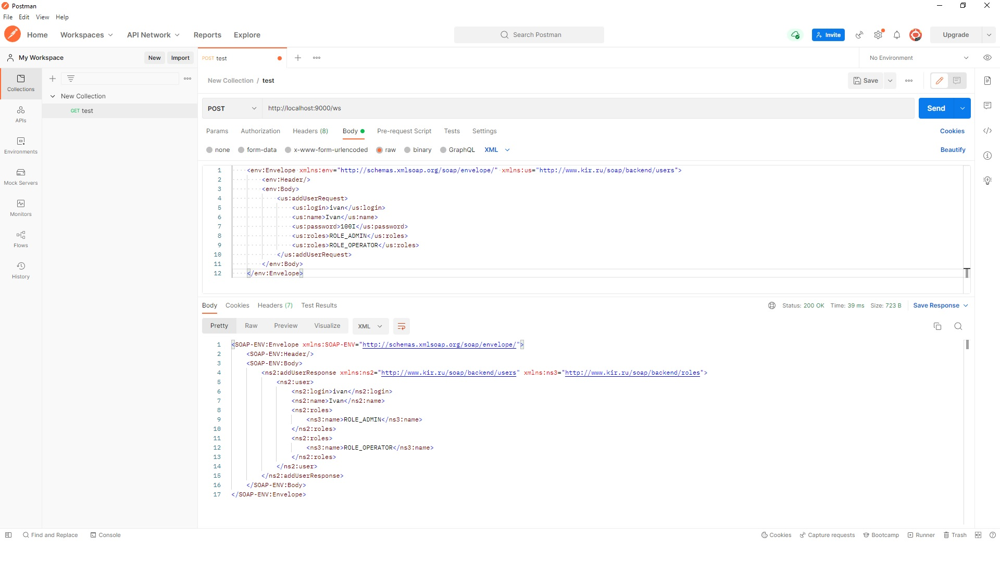

# Проект: SOAP веб-сервис, созданный с использованием Spring Framework.
___
## Стек: Spring Framework (Boot, Web Services, JPA Data), SOAP, JAXB, WSDL4J, Flyway, H2 Database, Lombok.
___
## Функционал:
___
* Реализована возможность получения WSDL-документа.
* Существует возможность поиска и отображения всех пользователей.

* Реализована возможность поиска и отображения пользователя с его ролями.

* Существует возможность добавления нового пользователя.

* Реализована возможность изменения данных пользователя.

* Существует возможность удаления пользователя.
* Реализована валидация данных и отображение ошибок при некорректном запросе.

  
* В папке "to_validate_requests" расположен файл "requests_xml.docx" со сформированными запросами,
  которые можно протестировать (например, через Postman).